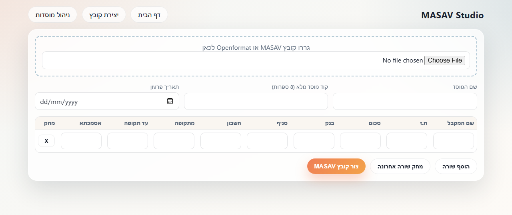

# masav-zikuim

**Read, validate and generate MASAV payment files in TypeScript.**

MASAV (מס"ב) is Israel's inter-bank clearing house. Payment instructions — salaries, supplier
payments, credits (_zikuim_) — are submitted to it as fixed-width `.msv` files: every field sits at
an exact byte offset, Hebrew text is encoded in CP862, and a malformed record is rejected by the
bank with no useful diagnostics.

This service handles that format end-to-end: it parses an existing file into structured JSON,
validates it against the specification, and generates a new compliant file from edited data. A
small SPA client provides a UI for the create flow.

Originally written in PHP with jQuery, migrated to JavaScript and then to TypeScript. In continuous
personal use since 2019.

## Stack

Bun · TypeScript · REST API · vanilla SPA client

## Screenshot

The create flow — import an existing MASAV/Openformat file or build one from scratch:



## Project structure

- `src/server.ts` — Bun HTTP server: API routes + static serving of the built client.
- `src/lib/` — the core: `masav-reader.ts` (parser + validator), `masav-writer.ts` (generator), `openformat-reader.ts` (pension "openformat" XML import), `encoding.ts` (CP862 Hebrew handling), `masav-types.ts`, `mosad-store.ts` (institution profiles).
- `src/tests/` — Bun test suite over the reader, writer and openformat import.
- `client/src/` — SPA client (home + MASAV creation flow), built to `client/build/` via `bun run build:client`.
- `openformat/`, `example.txt` — sample input files with fictitious data, used by the tests.
- `data/` — local institution profiles (gitignored).

## Run

```bash
bun install
bun run dev
```

Open: `http://localhost:3000`

## Build client

```bash
bun run build:client
```

## API endpoints

- `POST /api/masav/read` (multipart form-data, file field `msvZfile`)
  - parses and validates a MASAV file
  - returns designed JSON payload
- `POST /api/masav/validate` (multipart form-data, file field `msvZfile`)
  - validates a MASAV file
  - returns `{ valid, errors }`
- `POST /api/masav/generate` (application/json)
  - accepts designed data payload
  - returns `{ fileName, rawFile }`

The parsing and writing logic is ported from the original PHP implementation behavior, including fixed-position fields and CP862 Hebrew encoding handling.
